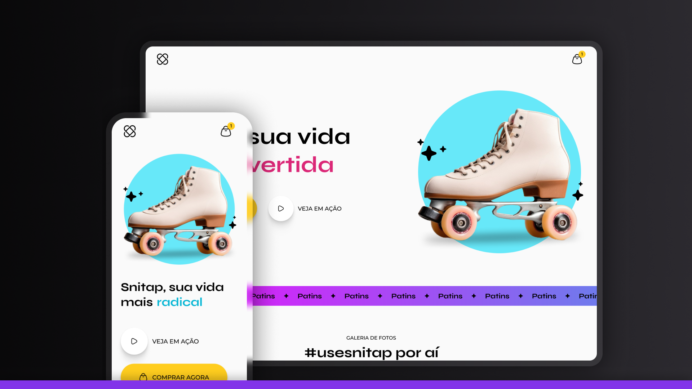

# Snitap Patins 

A modern, animated landing page for a roller skates brand built with pure HTML, and CSS. This project showcases advanced CSS animations, responsive design, and modern web development techniques.



## 🌐 Demo

Access the online version: [Live Snitap](https://maurodiogodev.github.io/snitap/) 

## 📋 About

Snitap Patins is a fictional roller skates brand landing page designed to demonstrate modern web development skills. The project features a vibrant, energetic design with smooth animations and interactive elements that capture the fun and dynamic nature of roller skating.

## ✨ Key Features

### 🎨 Design & UI
- **Modern, vibrant design** with colorful gradients and engaging visuals
- **Responsive layout** that adapts to different screen sizes
- **Custom CSS variables** for consistent theming
- **Interactive hover effects** and micro-animations

### ♻️ Advanced Animations
- **Text cycling animation** in the hero section with bouncing effects
- **Slide-in animations** for hero images with staggered timing
- **Scroll-triggered animations** using CSS `animation-timeline: view()`
- **Infinite scrolling banner** with gradient background animation
- **Image hover effects** with scale transformations

### 📱 Responsive Design
- **Mobile-first approach** with breakpoint at 375px
- **Flexible grid layouts** using CSS Grid
- **Adaptive typography** and spacing
- **Touch-friendly interactive elements**

### 🎯 Advanced CSS Techniques
- **CSS Grid** for complex gallery layouts
- **CSS Custom Properties** (CSS Variables) for theming
- **Advanced CSS Selectors** and pseudo-elements
- **CSS Transforms and Transitions** for smooth interactions
- **Gradient animations** and background effects
- **Box shadows** with multiple layers for depth

## 🏗️ Project Structure

```
snitap-patins/
├── index.html
├── styles/
│   ├── index.css (main imports)
│   ├── global.css (variables and base styles)
│   ├── header.css
│   ├── hero.css
│   ├── banner.css
│   ├── gallery.css
│   └── footer.css
├── assets/
│   ├── icons/
│   ├── images/
│   └── hero/
└── README.md
```

## 🎓 Learning Concepts Applied

### CSS Architecture
- **Modular CSS** with separate files for each component
- **BEM-like naming conventions** for maintainable code
- **CSS imports** for organized stylesheets

### Animation Techniques
- **Keyframe animations** with complex timing functions
- **Animation delays** and staggered effects
- **Scroll-based animations** using modern CSS features
- **Transform animations** for performance optimization

### Responsive Design
- **Flexible layouts** using modern CSS Grid and Flexbox
- **Responsive images** and media queries
- **Mobile-first responsive breakpoints**

### Modern CSS Features
- **CSS Custom Properties** for dynamic theming
- **CSS Grid** for complex layouts
- **Advanced pseudo-selectors** and combinators
- **CSS animation-timeline** for scroll-triggered animations

## 🌟 Highlights

- **Pure CSS animations** - No JavaScript frameworks needed for smooth animations
- **Performance optimized** - Uses CSS transforms for hardware acceleration
- **Accessibility considerations** - Semantic HTML and proper contrast ratios
- **Modern CSS techniques** - Showcases cutting-edge CSS features
- **Clean, maintainable code** - Well-organized and commented stylesheets

## 🎯 Skills Demonstrated

- Advanced CSS Grid and Flexbox layouts
- Complex CSS animations and keyframes
- Responsive web design principles
- Modern CSS features and best practices
- Component-based CSS architecture
- Cross-browser compatibility considerations

*Note: Some advanced CSS features like `animation-timeline` may require modern browser versions.*

Design UI/UX by [Rocketseat](https://www.rocketseat.com.br/)

<div align="center"> <p>Built with ❤️ and lots of CSS animations</p> <p>Feel free to contribute or get in touch!</p> </div>
